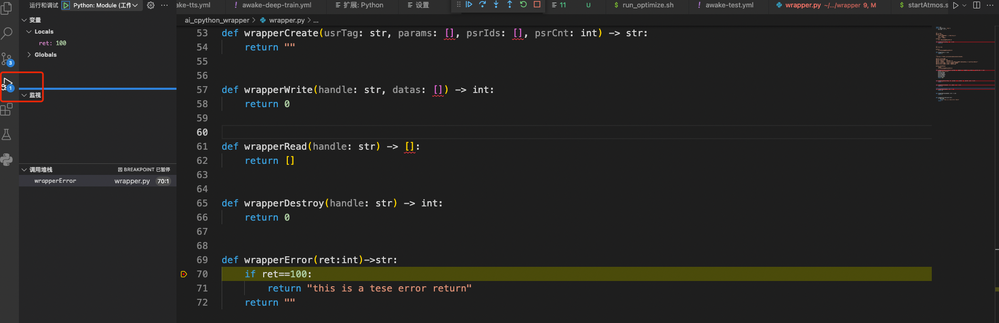
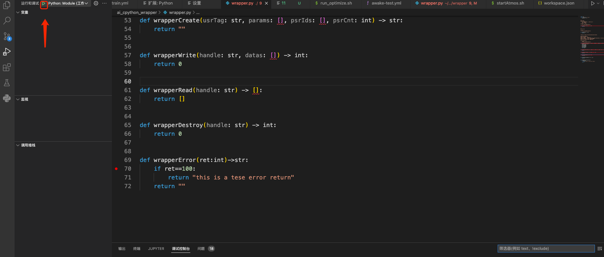
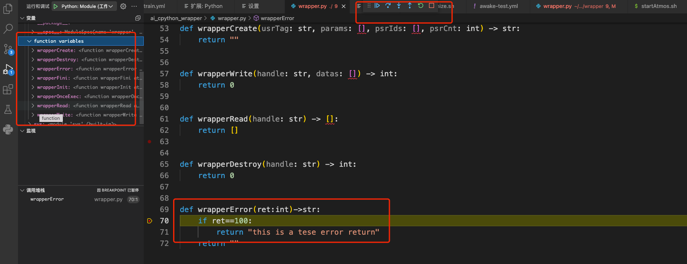

# Aiges Python

## Features

* 用于本地模拟加载 wrapper.py脚本运行
* 用于生成 wrapper.py项目工程
* 

## 原理

模拟加载器行为
1. 找到wrapper.py
2. 检验wrapper中的实现是否包含必须要实现的
3. 顺序调用 wrapper.py 中的 wrapperInit -> wrapperExec -> wrapperFinish

## 项目打包

* pip install poetry
* poetry build

至此 打包出了 whl包可供 pip直接安装下载，稳定后将发布到外网pypi源支持公网用户下载

## 项目使用

本项目意指在vscode中可直接调试推理 wrapper.py 插件

需要在vscode中配置工作区的 launch.json

vscode debug 配置方法

0. 确保vscode中使用的解释器或者工作区的python解释器 安装过本项目，方法:
    - `pip install aiges_python` (当前不可用)
    -  `pip install ./dist/aiges_python-0.1.0-py3-none-any.whl` (当前可用,需要自己poetry build)

1. 打开工作区，确保工作区下有 wrapper.py以及其对应python依赖代码

2. 选中 vscode 运行调试tab页

3. 点击齿轮配置, 更改 module 和 添加 args如下

4. 至此本地可调试 wrapper.py

点击绿色播放调试按钮:

单步，调试 并查看调用堆栈:

